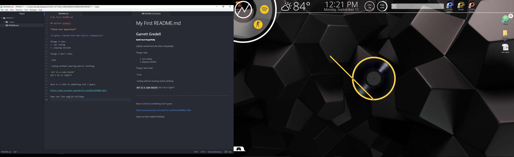

# My First README.md
new text line
another new text line

## Garrett Gredell

**bold text hopefully**

*slightly slanted text aka Italics (hopefully)*

Things I like:
1. not coding
2. playing outside

Things I don't like:

- Tuna

- coding without wearing matrix clothing

`wtf is a code block?`
did I do it right??

---
here is a link to something cool I guess

[hope you like english bulldogs](https://www.youtube.com/watch?v=nyZk6CGdfhM&t=383s)

Honestly this has been one of the most difficult first assignments for any class. Probably because I have no experience with coding. Its gonna be a journey, but I like journeys... usually.
